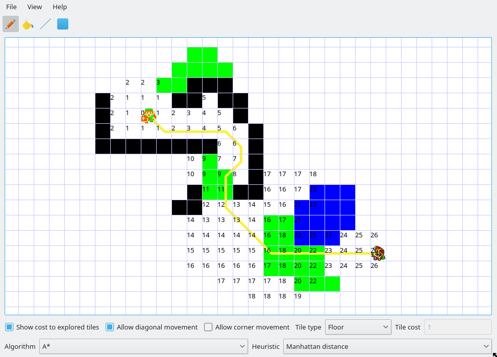

# pathfinding-simulator
Simulates and draws paths between two points in a tile based map with weights.
It also includes an editor to easily set the weights of the tiles, and the path is recalculated interactively as the map is modified.

The simulator supports several pathfinding algorithms, as well as different heuristics for the algorithms that use one.

